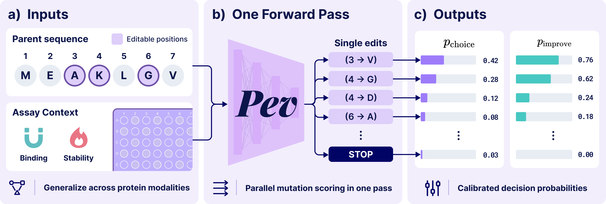
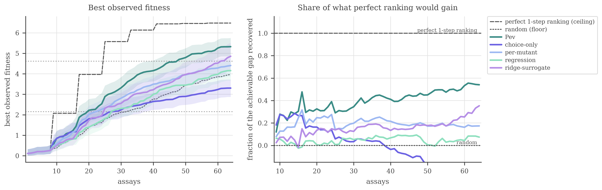
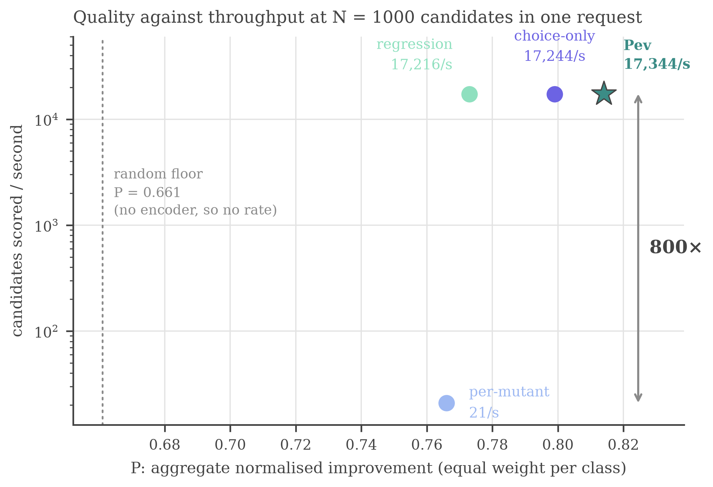

<h1 align="center">A System One Approach to General Protein Evolution</h1>
<h3 align="center"><em>One model. All tasks. One pass.</em></h3>

<p align="center"></p>

<p align="center">
  <strong>Pev</strong> encodes a parent protein <strong>once</strong>, scores every allowed mutation <strong>in parallel</strong>, and returns an edit or <strong>STOP</strong>. One set of weights serves peptides, small folded domains, and antibodies, conditioned on binding or stability.
</p>
<p align="center">
  It returns <strong>calibrated probabilities</strong>, not just a ranking: the probability that an edit is the best offered action, and the probability that it improves the measured assay outcome.
</p>

<p align="center">
  
  <a href="https://yibow.me/pev"></a>
  <a href="https://huggingface.co/Yibooooo/Pev"></a>
</p>

## About Pev

**Pev is a general mutation policy for protein design.** One set of weights, trained once on
measured outcomes from many protein families, proposes edits for families it has never seen across
peptides, small folded domains and antibodies, under either binding or stability. It turns **one**
parent encoding into **parallel** probabilities over every legal mutation and STOP -- stop meaning
*retain the best measured sequence so far*.

<p align="center"></p>

- **One pass per decision.** A decision costs one backbone pass, not one per candidate. At 1,000
  candidates in a single request that is over 800× the throughput of an identical per-mutant encoder.
- **Zero-shot inference on novel families.** A family-specific model needs measurements on that
  family, so a general policy is available exactly when assays are scarcest.
- **Calibrated probabilities.** More than a ranking: both heads are trained with proper scoring
  rules and calibrated post-hoc on held-out families.

The two heads answer *different* questions: `p_choice[a]` is the probability that this edit wins the
offered panel, `p_improve[a]` that it improves the measured outcome.

**Scope.** Two objectives (binding, stability), three sequence classes, single substitutions only.
Splits are by family, and a family held out for one property stays held out for every property.

Inspired by [Jev](https://typesafe.ai/blog/introducing-system-one-models-and-jev). This is an
explicit supervised approach with proper scoring losses and held-out calibration, **not** a
reproduction of TypeSafe's unpublished RLCD recipe.

## Getting Started

Needs Python 3.12 and [uv](https://docs.astral.sh/uv/getting-started/installation/).
```bash
git clone https://github.com/Yibo-Wen/Pev.git && cd Pev
uv sync
```

**Download the evaluation data.** Download
[**`pev-exp1-test.zip`**](https://drive.google.com/file/d/1rSBJ74TMeL3_uXt9Axx0bCgyOOmEPMI5/view?usp=sharing)
(9 MB) into the repository root, unpack it, and check it:

```bash
unzip pev-exp1-test.zip
make check
```

**Download the model.** Download from
[**Yibooooo/Pev**](https://huggingface.co/Yibooooo/Pev) -- 6 MB of heads and conditioning over a
frozen `facebook/esm2_t33_650M_UR50D` backbone.

```bash
.venv/bin/hf download Yibooooo/Pev --include "checkpoints/*" --local-dir .
make discovery      # the discovery screen
```

Every number lands in `results/discovery/` as a table. `make all` chains the check and the screen,
and reproduces the discovery-screen tables below; the closed-loop campaign and the throughput
frontier are described here but their code is not part of this release.

The checkpoint also carries `calibration.json`, the post-hoc calibrator fitted on held-out families;
`pev.calibration.load()` applies it. The screen does not, because every metric it reports is
rank-based and the calibration is rank-preserving -- so the tables hold with it and without it.

## Results

Three experiments: a **discovery screen** on held-out families, a **closed-loop campaign** on the
GB1 four-site landscape, and the **quality/throughput frontier** against a per-mutant encoder.

### Finding beneficial mutations in unseen families

The primary test. A panel is one measured reference protein and every measured single substitution
of it, from families reserved before training. A lab gets ten wells. An edit counts as beneficial
when it clears both replicate noise and a meaningful effect fixed in advance from convention;
unmeasured mutations are absent from the panel rather than scored as misses.

| method | Hit rate @10 ↑ | Enrichment @10 ↑ | AUROC ↑ | Wells to first hit ↓ |
| --- | --- | --- | --- | --- |
| *Perfect ranking* | *0.949* | *18.94×* | *1.000* | *1.0* |
| **Pev** | **0.424** | **7.19×** | **0.729** | **6.1** |
| ESM-2 zero-shot | 0.231 | 2.80× | 0.545 | 48.3 |
| Random | 0.128 | 1.02× | 0.497 | 27.8 |

**Pev returns a beneficial mutation in 2 of every 5 wells where random screening returns 1 in 8.**

Wells-to-first-hit is the one column where the untrained backbone does worse than random (48.3
against 27.8), and it is not a glitch: a confidently wrong ranking is worse than no ranking at all
for *time to first hit*, and ESM-2's stability ordering is confidently wrong -- 80.6 wells on the 24
stability panels, against 11.4 on the 21 binding ones.

By sequence class, best in each row in bold:

| class | | Hit rate @10 | Enrichment @10 | AUROC |
| --- | --- | --- | --- | --- |
| **Domain**<br><sub>27 fam · 27 panels</sub> | **Pev** | **0.522** | **10.96×** | **0.828** |
| | ESM-2 zero-shot | 0.219 | 3.73× | 0.549 |
| | Random | 0.080 | 1.05× | 0.498 |
| **Peptide**<br><sub>7 fam · 13 panels</sub> | **Pev** | **0.246** | **1.32×** | **0.572** |
| | ESM-2 zero-shot | 0.215 | 0.87× | 0.506 |
| | Random | 0.199 | 1.00× | 0.495 |
| **Antibody**<br><sub>5 fam · 5 panels</sub> | Pev | **0.360** | 2.16× | 0.604 |
| | **ESM-2 zero-shot** | 0.340 | **2.81×** | **0.623** |
| | Random | 0.202 | 0.93× | 0.495 |

Domain carries the result. Peptide clears the untrained backbone on both yield and ranking.
Antibody is unresolved on five families: Pev returns more hits per ten wells than the backbone,
but still trails it on enrichment.

### Better sequences per assay in a closed loop

A closed-loop campaign on the GB1 four-site landscape, a target Pev has never seen. Each round the
policy proposes a batch, the assays come back, and the next round conditions on what they said. The
comparison that matters is not random but a ridge surrogate refit on the target's own assays every
round, which is what a practitioner actually reaches for.

<p align="center"></p>

**Best observed fitness against assay budget**, every round of the campaign with a
paired-initialisation bootstrap interval over fifty initialisations. The right panel rescales by
what perfect one-step ranking would gain rather than by the landscape maximum, so the remaining
headroom is the limit of single-edit walks and not of the model.

**Pev leads at every budget**, reaching 5.33 against the surrogate's 4.86 at sixty-four assays. Its
margin narrows as the surrogate accumulates data -- 39% ahead at sixteen assays, 32% at thirty-two,
10% at sixty-four -- and that narrowing is the point: the claim is that a general policy is useful
*before* a target-specific one can be fitted, and the crossover is what makes it falsifiable. The
policy's probabilities drop straight into standard search, since ranking by `p_improve` is
probability of improvement, the textbook acquisition function, and the model is unchanged either
way.

### Pareto frontier with one-pass scoring

Scoring candidates in parallel is not a trade of accuracy for throughput. Against a per-mutant
encoder, which re-encodes the parent once for every candidate it scores, it is a **Pareto
improvement**: over **800×** the throughput at a realistic N = 1000 candidates in a single request
-- 17,344 per second against 21 -- and at the best improvement probability of any variant. Pev is
the only point on the frontier.

<p align="center"></p>

**Quality against throughput at N = 1000**, on held-out parent states. Four variants trained
identically on the current corpus, so the comparison isolates what parent reuse costs and buys. The
throughput figures are measured candidate-scoring rates for one request on one GPU, both methods on
the same machine and the same backbone; they are a property of the encoding strategy, not of the
hardware, which is why the ratio is the number worth quoting.


## Intended use and limits

Pev is for **ranking candidate single substitutions** in a protein-engineering campaign, as a prior
when no assay data on the target exists yet -- which is exactly when a family-specific model cannot
be fitted. It is wrong to use it for:

- **Insertions, deletions or multi-residue designs.** Single substitutions only.
- **Objectives it was not trained on.** Binding and stability only; not expression, solubility,
  immunogenicity or developability.
- **A substitute for assays.** The headline means 2 of every 5 wells return a beneficial edit rather
  than 1 in 8 -- not that the top-ranked edit works.
- **Antibodies, without care.** The weakest class: five test families, and the untrained backbone
  still ranks slightly better on enrichment.
- **Anything clinical or safety-critical.**

## Data

The training corpus came from [AlphaSeq](https://github.com/mit-ll/AlphaSeq_Antibody_Dataset)
(MIT Lincoln Laboratory, CC BY-NC-SA 4.0), [MegaScale](https://doi.org/10.5281/zenodo.7992926)
(Tsuboyama 2023, CC BY 4.0), [FireProtDB](https://loschmidt.chemi.muni.cz/fireprotdb),
[ProteinGym](https://github.com/OATML-Markslab/ProteinGym) (MIT),
[SKEMPI 2.0](https://life.bsc.es/pid/skempi2), [SLiM DMS](https://doi.org/10.5281/zenodo.15297111)
(Benz 2025, CC BY 4.0), [AbAgym](https://github.com/3BioCompBio/Abagym) (Cia 2025, non-commercial),
[FLAb](https://github.com/Graylab/FLAb) (per-study terms) and the
[GB1 four-site landscape](https://doi.org/10.7554/eLife.16965) (Wu 2016, CC BY 4.0). Please cite
them alongside this work, and take the primary data from them for anything beyond reproducing the
numbers here.

## Contributors

Pev Team

## Citation

A preprint is forthcoming. In the meantime:

```bibtex
@misc{wen2026pev,
  title={A System One Approach to General Protein Evolution},
  author={Pev Team},
  year={2026},
  howpublished={\url{https://yibow.me/pev}},
  url={https://yibow.me/pev},
}
```
